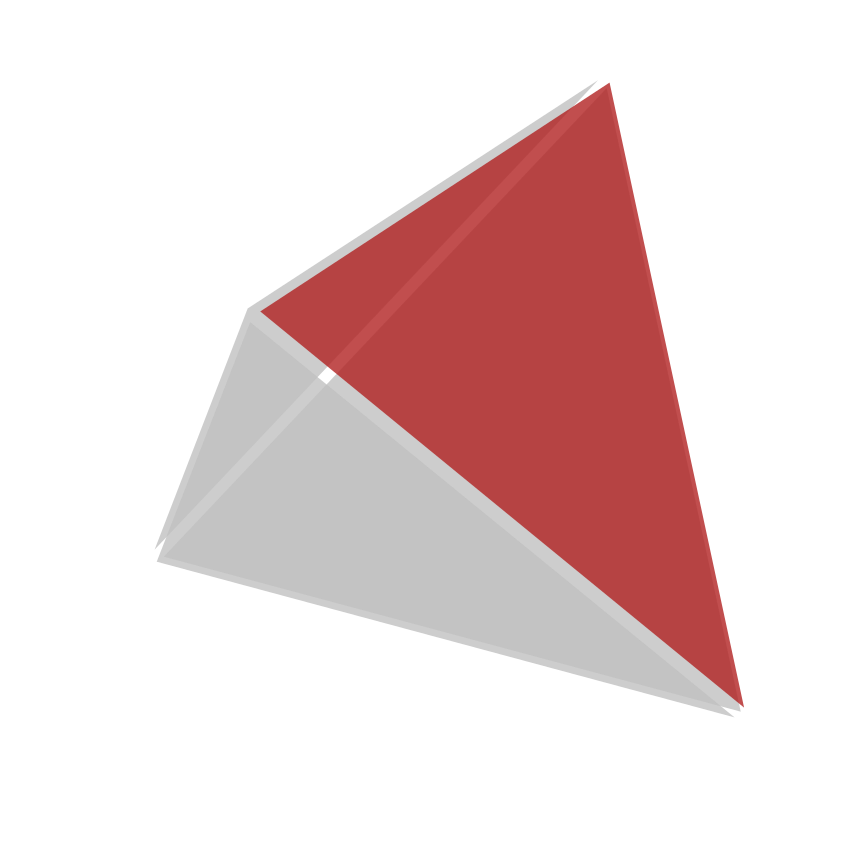
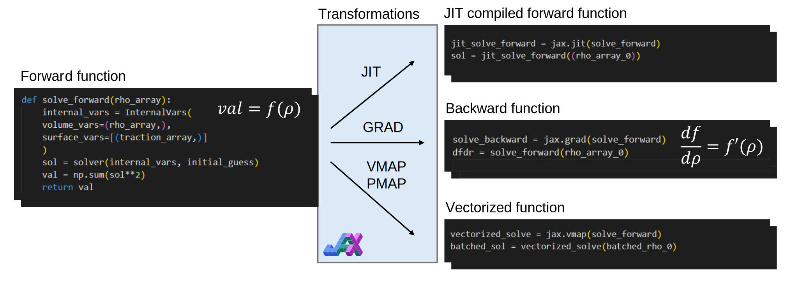

# FEAX 

[](LICENSE)
[](https://www.python.org/downloads/)
[](https://github.com/google/jax) </img>

**FEAX** (Finite Element Analysis with JAX) is a compact, high-performance finite element analysis engine built on JAX. It provides an API for solving partial differential equations on XLA.


## What is FEAX? 

FEAX combines automatic differentiation with finite element methods. It's designed for: 

- **Differentiable Physics**: Compute gradients through entire FE simulations for optimization, inverse problems, and machine learning
- **High Performance**: JIT compilation and vectorization through JAX for maximum computational efficiency 

## JAX Transformations in FEAX

<div align="center">

</div>

FEAX leverages JAX's powerful transformation system to enable:
- **Automatic Differentiation**: Compute exact gradients through finite element solvers
- **JIT Compilation**: Compile to optimized machine code for maximum performance  
- **Vectorization**: Efficiently process multiple scenarios in parallel with `vmap`
- **Parallelization**: Scale across multiple devices with `pmap`

## Installation

### Basic Installation (CPU only)
```bash
pip install feax
```

### GPU/CUDA 12 Installation (Recommended)

FEAX with GPU acceleration requires a two-step installation process:

#### Option 1: Using the installation script (for development)
```bash
git clone https://github.com/Naruki-Ichihara/feax.git
cd feax
./install-cuda12.sh
```

#### Option 2: Manual installation (from PyPI)
```bash
# Step 1: Install FEAX with CUDA 12 dependencies
pip install feax[cuda12]

# Step 2: Install spineax (CUDA sparse solver)
# The --no-build-isolation flag is required to access CUDA libraries from Step 1
pip install --no-build-isolation git+https://github.com/johnviljoen/spineax.git
```

## feax.flat

Flat (Feax Lattice) is a utility for asymptotic homogenization of lattice unit cell.

## feax.gene

**Gene** (Generative design in FEAX) is a comprehensive toolkit for topology optimization and generative design. It provides efficient, JAX-native implementations of common topology optimization components.

### Key Features

- **Response Functions**: Compliance and volume fraction calculations optimized for topology optimization
- **Filtering Methods**:
  - PDE-based Helmholtz filter for smooth, physically-motivated designs
  - Distance-based density filter for efficient spatial smoothing
  - Sensitivity filter for mesh-independent gradient smoothing
- **Constrained Optimization**: MDMM (Modified Differential Multiplier Method) for handling equality and inequality constraints with automatic differentiation
- **Pure JAX Implementation**: Fully differentiable and compatible with optax optimizers

### Quick Example

```python
import feax
from feax.gene import create_compliance_fn, create_volume_fn, create_density_filter, mdmm
import optax

# Create response functions
compliance_fn = create_compliance_fn(problem)
volume_fn = create_volume_fn(problem)

# Create density filter
filter_fn = create_density_filter(mesh, radius=3.0)

# Define objective with filtering
def objective(params):
    rho_filtered = filter_fn(params['rho'])
    sol = solver(rho_filtered)
    return compliance_fn(sol)

# Add volume constraint with MDMM
constraint = mdmm.ineq(
    lambda params: 0.4 - volume_fn(filter_fn(params['rho'])),
    damping=10.0,
    weight=100.0
)

# Use with any optax optimizer
optimizer = optax.chain(
    optax.adam(0.05),
    mdmm.optax_prepare_update()
)
```

See `examples/advance/topology_optimization_mdmm.py` for a complete topology optimization example.

## License

FEAX is licensed under the GNU General Public License v3.0. See [LICENSE](LICENSE) for the full license text.

## Acknowledgments

FEAX builds upon the excellent work of:
- [JAX](https://github.com/google/jax) for automatic differentiation and compilation
- [JAX-FEM](https://github.com/tianjuxue/jax_fem) for inspiration and reference implementations

---
<div align="center">
</img>
</div>

