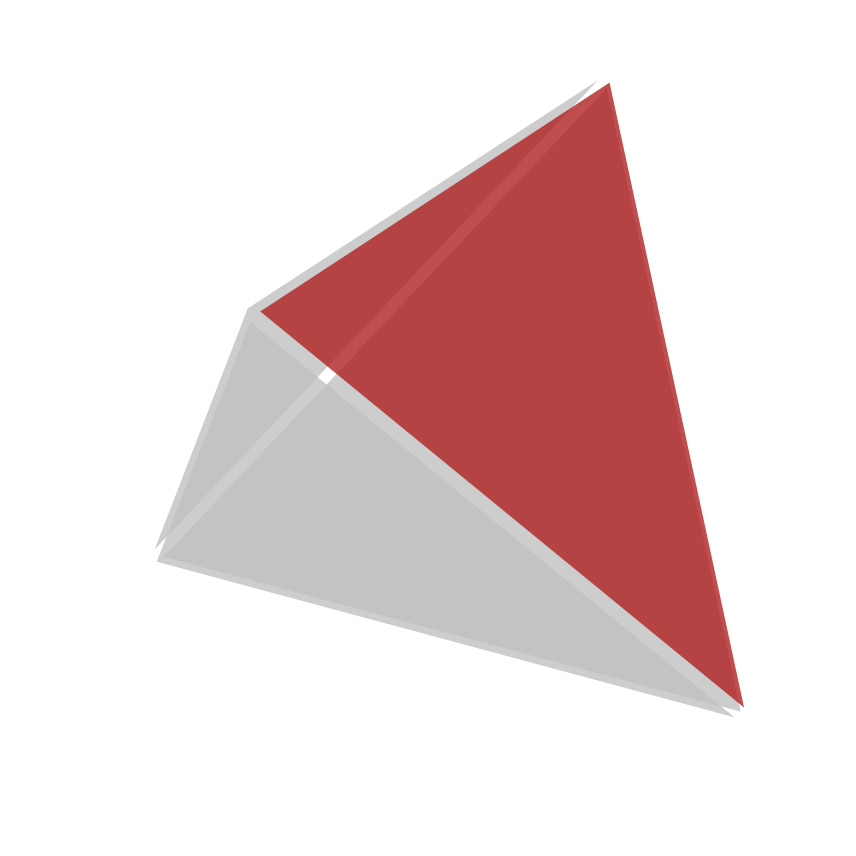

<div align="center">
</img>
</div>

# [FEAX](https://naruki-ichihara.github.io/feax/) 


### *A simulation node in your JAX workflow*

[**Documentation**](https://naruki-ichihara.github.io/feax/)
| [**Install guide**](https://naruki-ichihara.github.io/feax/getting-started/installation)
| [**API**](https://naruki-ichihara.github.io/feax/api/)

[](LICENSE)
[](https://www.python.org/downloads/)
[](https://github.com/google/jax) 

**FEAX** (Finite Element Analysis with JAX) is a fully differentiable finite element engine. Every stage — from assembly to solve — runs on XLA and is compatible with `jax.jit`, `jax.grad`, and `jax.vmap`, enabling gradient-based optimization and machine learning directly on PDE simulations.

## Why FEAX?

FEAX is a fully differentiable finite element engine built on JAX. All solvers — including the GPU-accelerated direct solver via [cuDSS](https://docs.nvidia.com/cuda/cudss/) — are compatible with JAX transformations (`jit`, `grad`, `vmap`). This means you can compute exact gradients through the entire simulation pipeline without any approximation.

- **JAX Transformations**: Solvers work seamlessly with `jax.jit`, `jax.grad`, and `jax.vmap`, and arbitrary compositions such as `jit(grad(...))`.
- **GPU Direct Solver**: Native cuDSS integration for sparse direct solves on GPU, with automatic matrix property detection (General / Symmetric / SPD).
- **End-to-End Differentiability**: Gradients flow through assembly, boundary conditions, linear/nonlinear solvers, and post-processing — enabling topology optimization, inverse problems, and physics-informed learning.
- **Neural Network Research**: The consistent differentiability makes FEAX a natural building block for coupling neural networks with PDE solvers.


## Quick Example

3D cantilever beam under traction — solve and compute gradients in a few lines:

```python
import feax as fe
import jax
import jax.numpy as np

# Mesh and material
mesh = fe.mesh.box_mesh((100, 10, 10), mesh_size=2)
E, nu = 70e3, 0.3

# Define the constitutive law
class LinearElasticity(fe.problem.Problem):
    def get_tensor_map(self):
        def stress(u_grad, *args):
            mu = E / (2. * (1. + nu))
            lmbda = E * nu / ((1 + nu) * (1 - 2 * nu))
            eps = 0.5 * (u_grad + u_grad.T)
            return lmbda * np.trace(eps) * np.eye(self.dim) + 2 * mu * eps
        return stress

    def get_surface_maps(self):
        def surface_map(u, x, traction_mag):
            return np.array([0., 0., traction_mag])
        return [surface_map]

left  = lambda point: np.isclose(point[0], 0.,   atol=1e-5)
right = lambda point: np.isclose(point[0], 100., atol=1e-5)

problem = LinearElasticity(mesh, vec=3, dim=3, location_fns=[right])

# Boundary conditions: fix the left face
bc_config = fe.DCboundary.DirichletBCConfig([
    fe.DCboundary.DirichletBCSpec(location=left, component="all", value=0.)
])
bc = bc_config.create_bc(problem)

# Internal variables (surface traction magnitude)
traction = fe.InternalVars.create_uniform_surface_var(problem, 1e-3)
internal_vars = fe.InternalVars(volume_vars=(), surface_vars=[(traction,)])

# Create solver (auto-selects cuDSS on GPU, sparse direct on CPU)
solver = fe.create_solver(problem, bc,
    solver_options=fe.DirectSolverOptions(), iter_num=1,
    internal_vars=internal_vars)
initial = fe.zero_like_initial_guess(problem, bc)

# Solve
sol = solver(internal_vars, initial)

# Differentiate through the entire solve
grad_fn = jax.grad(lambda iv: np.sum(solver(iv, initial) ** 2))
grads = grad_fn(internal_vars)
```

See [examples/](examples/) for more, including topology optimization.

## Features

- **Assembly-based solvers**: Sparse direct (cuDSS on GPU, spsolve on CPU) and iterative (CG, BiCGSTAB, GMRES) solvers with automatic matrix property detection.
- **Matrix-free Newton solver**: JVP-based tangent operator for problems with custom energy contributions (cohesive zones, phase-field fracture) — no sparse matrix assembly.
- **Multi-variable problems**: Coupled multi-physics via a high-level weak form interface (`get_weak_form()`), with automatic interpolation and integration.
- **Multipoint constraints**: Prolongation matrix support for periodic boundary conditions and other constraint types.
- **Topology optimization**: Built-in `gene` toolkit with MMA optimizer, density filters, Heaviside continuation, and adaptive remeshing.
- **Computational homogenization**: `flat` toolkit for periodic unit cell analysis with graph-based lattice structure definition.

## Installation

```bash
pip install feax[cuda13]
pip install --no-build-isolation git+https://github.com/johnviljoen/spineax.git
```

### Optional: scikit-sparse (CPU host-side direct solvers)

The `cholmod` / `umfpack` direct solvers require [scikit-sparse](https://github.com/scikit-sparse/scikit-sparse), which depends on SuiteSparse ≥ 7.4.0. Without it, `DirectSolverOptions()` falls back to `spsolve` on CPU (or `cudss` on GPU).

```bash
# Ubuntu 24.04+ (system SuiteSparse is recent enough)
apt-get install -y libsuitesparse-dev
pip install feax[sksparse]
```

For Ubuntu 22.04 / Google Colab, the system `libsuitesparse-dev` is too old (5.10.1). Use the bundled helper, which also installs gmsh, NLopt, and other system dependencies that match the Dockerfile:

```bash
bash scripts/colab_setup.sh
pip install feax[sksparse]
```

## License

FEAX is licensed under the GNU General Public License v3.0. See [LICENSE](LICENSE) for the full license text.

## Acknowledgments

FEAX builds upon the excellent work of:
- [JAX](https://github.com/google/jax) for automatic differentiation and compilation
- [JAX-FEM](https://github.com/deepmodeling/jax-fem) for inspiration and reference implementations
- [Spineax](https://github.com/johnviljoen/spineax) for cuDSS solver implementation

---

