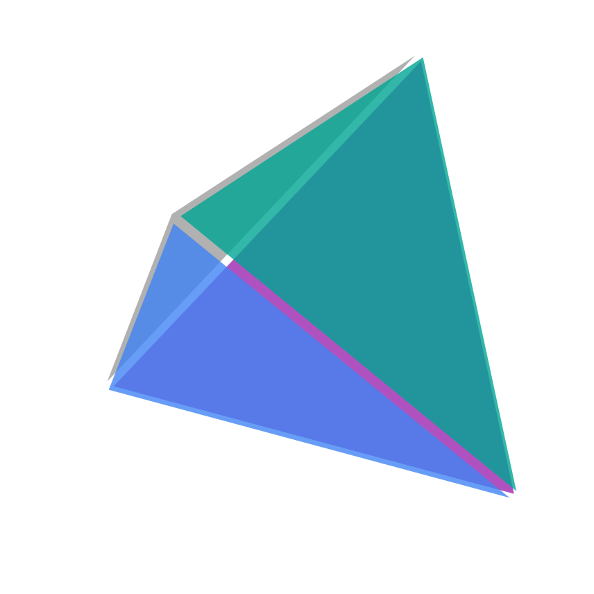

# FEAX 

[](LICENSE)
[](https://www.python.org/downloads/)
[](https://github.com/google/jax) </img>

**FEAX** (Finite Element Analysis with JAX) is a compact, high-performance finite element analysis engine built on JAX. It provides an API for solving partial differential equations on XLA.


## What is FEAX? 

FEAX combines automatic differentiation with finite element methods. It's designed for: 

- **Differentiable Physics**: Compute gradients through entire FE simulations for optimization, inverse problems, and machine learning
- **High Performance**: JIT compilation and vectorization through JAX for maximum computational efficiency 

## JAX Transformations in FEAX

<div align="center">

</div>

FEAX leverages JAX's powerful transformation system to enable:
- **Automatic Differentiation**: Compute exact gradients through finite element solvers
- **JIT Compilation**: Compile to optimized machine code for maximum performance  
- **Vectorization**: Efficiently process multiple scenarios in parallel with `vmap`
- **Parallelization**: Scale across multiple devices with `pmap`

## Installation
Use pip to install:
```bash
pip install feax
```

To install the latest commit from the main branch:
```bash
pip install git+https://github.com/Naruki-Ichihara/feax.git@main
```

## feax.flat

Flat (Feax Lattice) is a utility for asymptotic homogenization of lattice unit cell.

## License

FEAX is licensed under the GNU General Public License v3.0. See [LICENSE](LICENSE) for the full license text.

## Acknowledgments

FEAX builds upon the excellent work of:
- [JAX](https://github.com/google/jax) for automatic differentiation and compilation
- [JAX-FEM](https://github.com/tianjuxue/jax_fem) for inspiration and reference implementations

---
<div align="center">
</img>
</div>

